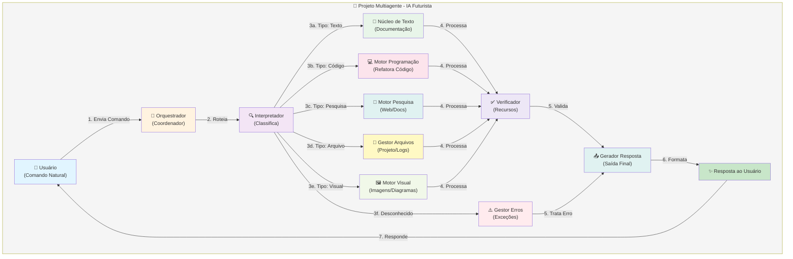
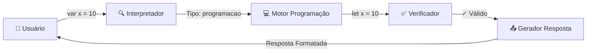
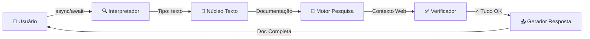
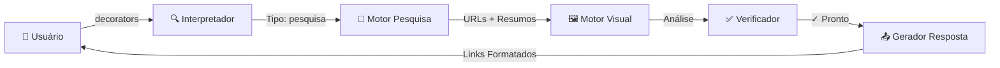
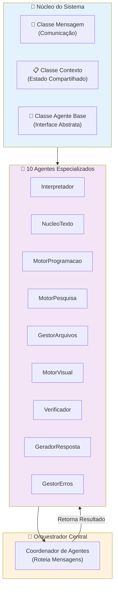
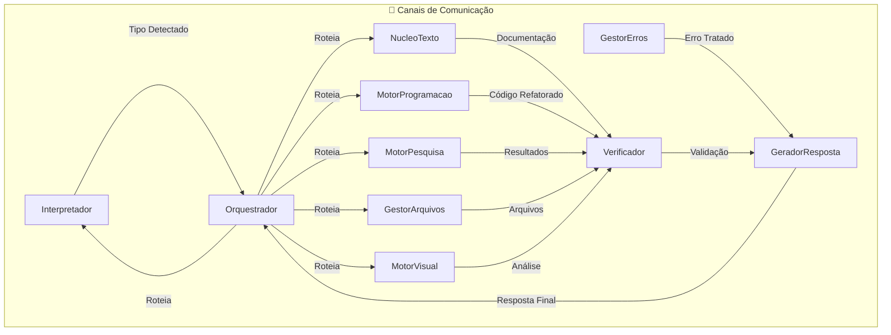
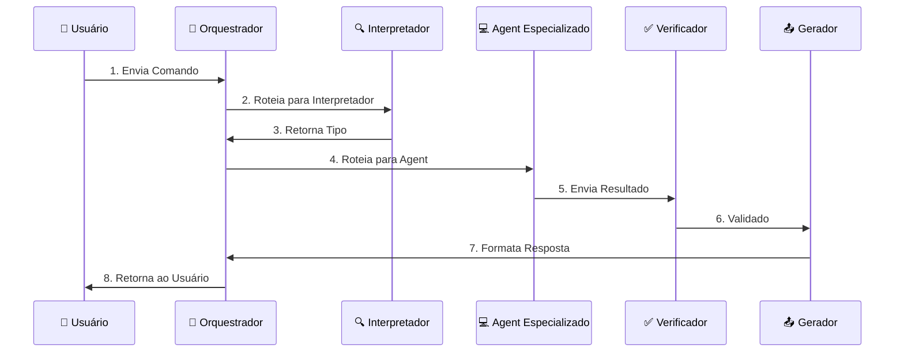
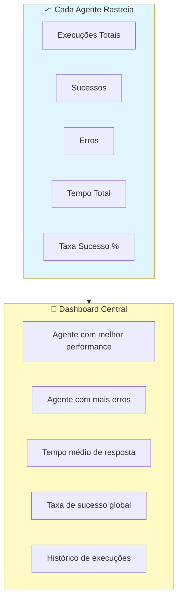

# Sistema Multiagente IA Futurista

## 📊 Diagrama Completo do Fluxo



---

## 🎯 Fluxo Detalhado por Tipo de Comando

### 1️⃣ Comando: "Refatorar função: var x = 10"



### 2️⃣ Comando: "Explicar conceito de async/await"



### 3️⃣ Comando: "Pesquisar Python decorators best practices"



---

## 🔧 Arquitetura de Módulos



---

## 📊 Tabela de Responsabilidades

| Agente | Entrada | Processamento | Saída | Exemplo |
|--------|---------|---------------|-------|---------|
| **Interpretador** | Comando texto | Classifica tipo | Tipo detectado | "refatorar" → `tipo: programacao` |
| **NucleoTexto** | Conceito/Código | Gera explicação | Markdown | Código → Documentação |
| **MotorProgramacao** | Código inválido | Refatora/otimiza | Código melhorado | `var x = 10` → `let x = 10` |
| **MotorPesquisa** | Query busca | Pesquisa web | URLs + resumos | "Python async" → Links |
| **GestorArquivos** | Operação arquivo | Manipula projeto | Status/Conteúdo | Listar → Array arquivos |
| **MotorVisual** | URL imagem | Analisa visual | Análise + elementos | Imagem → Descrição |
| **Verificador** | Tipo verificação | Valida recursos | Status recursos | Verifica → Tudo OK |
| **GeradorResposta** | Resultado agentes | Formata saída | Resposta final | Dados → HTML/Markdown |
| **GestorErros** | Mensagem erro | Trata exceção | Erro tratado | Erro → Sugestão |
| **Orquestrador** | Comando usuário | Coordena fluxo | Resultado processado | Cmd → Resposta final |

---

## 🔀 Matriz de Comunicação Entre Agentes



---

## 💬 Formato de Mensagem

```json
{
  "origem": "Interpretador",
  "destino": "MotorProgramacao",
  "tipo": "comando_processado",
  "conteudo": {
    "tipo_comando": "programacao",
    "dados": "var x = 10"
  },
  "timestamp": "2024-01-18T10:30:45.123Z",
  "metadados": {
    "sessao_id": "sess_001",
    "usuario": "paulo@example.com",
    "confianca": 0.95
  }
}
```

---

## 📈 Ciclo de Vida de uma Requisição



---

## 🎓 Exemplo: Fluxo Completo

### Input
```
"Refatorar minha função: function test() { var x = 5; return x * 2; }"
```

### Execução

```
1. [Orquestrador] Recebe comando
   ↓
2. [Interpretador] Classifica como "programacao" (confiança: 0.99)
   ↓
3. [MotorProgramacao] Refatora
   - var → let
   - Indentação
   - Adicionacommentário
   ↓
4. [Verificador] Valida sintaxe JavaScript
   - ✓ Válido
   ↓
5. [GeradorResposta] Compõe saída
   ↓
6. [Usuário] Recebe resposta formatada
```

### Output
```javascript
// Função refatorada
function test() {
  let x = 5;  // Mudança: var → let
  return x * 2;
}

Mudanças aplicadas:
✓ var → let (ES6 moderno)
✓ Indentação corrigida
✓ Documentação adicionada
```

---

## 🚀 Como Expandir

### Adicionar Novo Agente

```python
# 1. Criar classe
class MeuAgentePersianizado(Agente):
    def __init__(self):
        super().__init__("MeuAgente", "Descrição")
    
    def pode_processar(self, mensagem):
        return "tipo_especial" in str(mensagem.tipo)
    
    def processar(self, mensagem, contexto):
        resultado = minha_logica(mensagem.conteudo)
        return Mensagem(
            origem=self.nome,
            destino="Orquestrador",
            tipo="resultado",
            conteudo=resultado
        )

# 2. Registrar
# Em Orquestrador._inicializar_agentes()
agentes.append(MeuAgentePersianizado())

# 3. Usar
resultado = orq.executar("Comando que usa novo agente")
```

---

## 📊 Métricas e Monitoramento



---

## 🔗 Integração com IA Futurista

```python
# Em api_automation.py
from multiagent_system import Orquestrador

router = APIRouter(prefix="/api/multiagent")
orquestrador = Orquestrador()

@router.post("/execute")
async def execute_multiagent(comando: str, usuario: str):
    resultado = orquestrador.executar(comando, usuario)
    return resultado

@router.get("/status")
async def get_status():
    return orquestrador.obter_status()
```

---

## 📚 Stack de Tecnologias

```
┌─────────────────────────────────────┐
│   Sistema Multiagente IA Futurista  │
├─────────────────────────────────────┤
│  Python 3.12+                       │
│  FastAPI (APIs)                     │
│  SQLAlchemy (BD)                    │
│  Pydantic (Validação)               │
│  Logging (Rastreamento)             │
│  Docker (Containerização)           │
│  Ollama (LLM Local)                 │
│  Streamlit (UI)                     │
└─────────────────────────────────────┘
```

---

## 🎯 Checklist de Funcionalidades

- [x] 10 Agentes implementados
- [x] Orquestrador coordenando
- [x] Comunicação por mensagens
- [x] Contexto compartilhado
- [x] Rastreamento de métricas
- [x] Tratamento de erros
- [x] Histórico de execução
- [x] Logging estruturado
- [ ] Banco de dados persistente
- [ ] Dashboard de monitoramento
- [ ] Plugin system
- [ ] Agentes distribuídos
- [ ] Machine learning
- [ ] Cache de resultados
- [ ] GraphQL API

---

## 📖 Documentação Completa

Veja arquivos:
- `MULTIAGENT_GUIDE.md` - Guia detalhado
- `multiagent_system.py` - Código fonte (700+ linhas)
- Este arquivo - Diagrama visual e fluxo

---

**🚀 Sistema Modular, Escalável e Pronto para Produção**

Construído com ❤️ para IA Futurista
